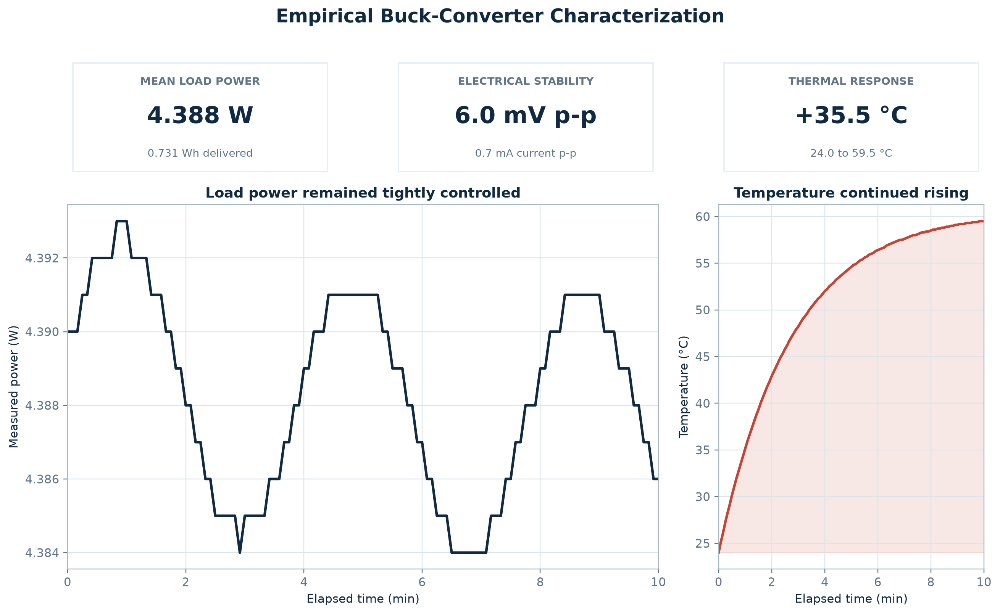
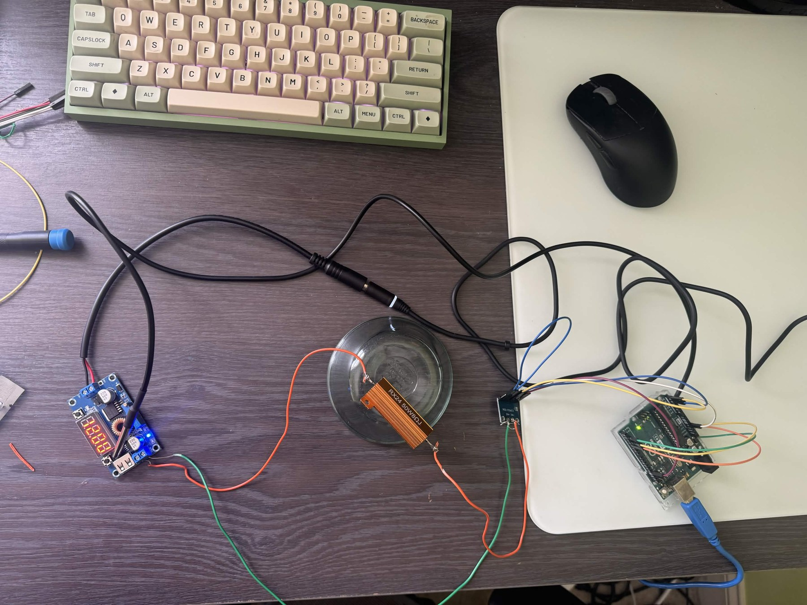
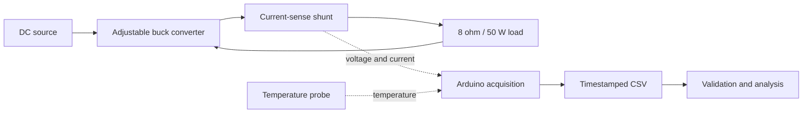
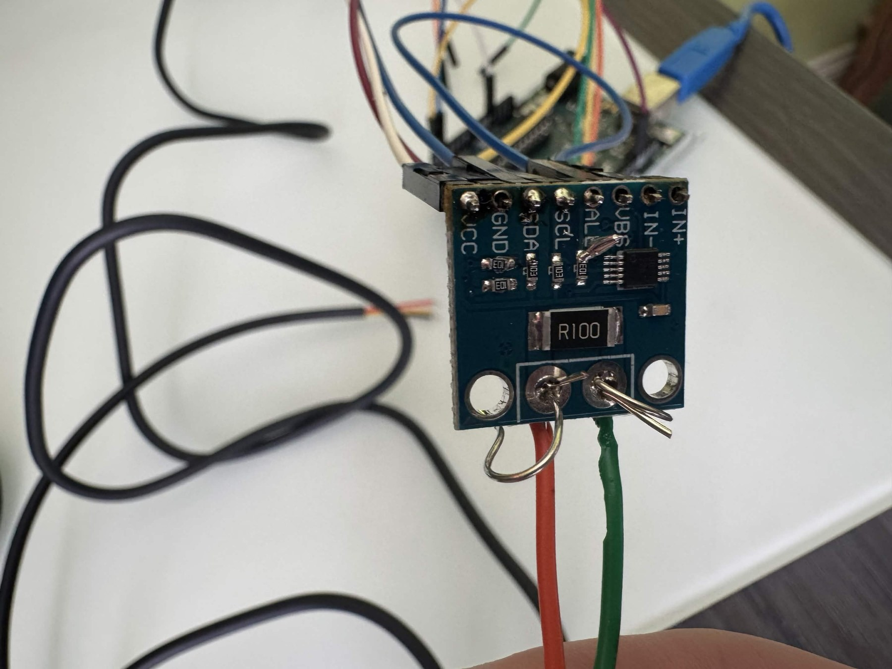
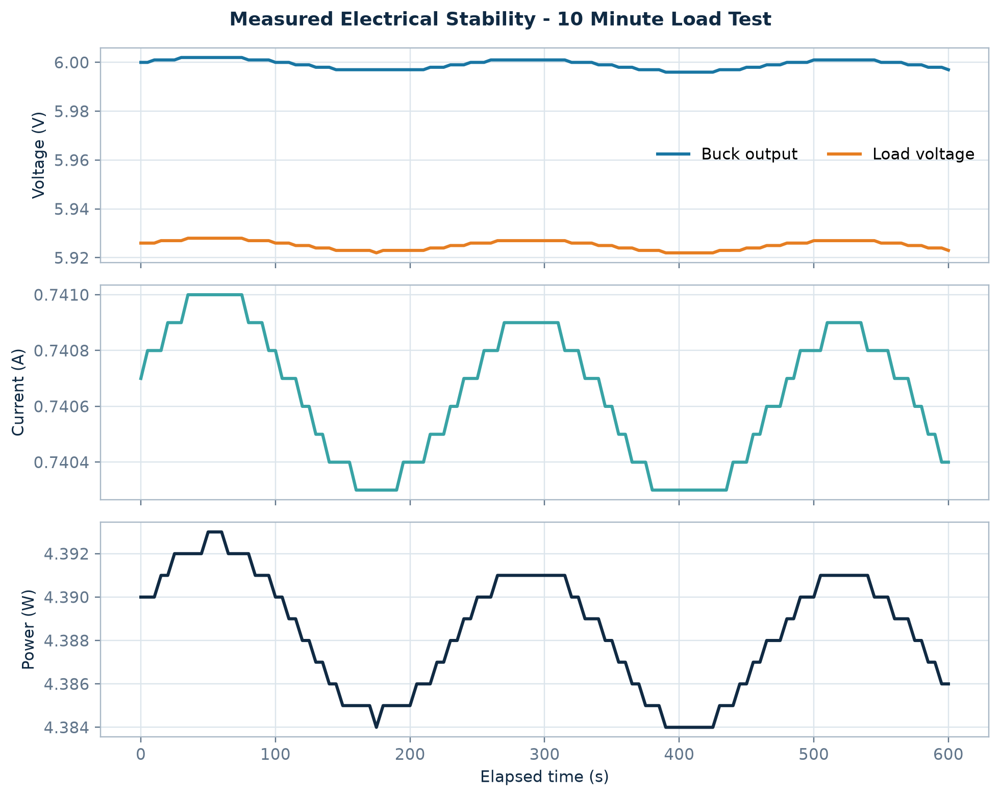
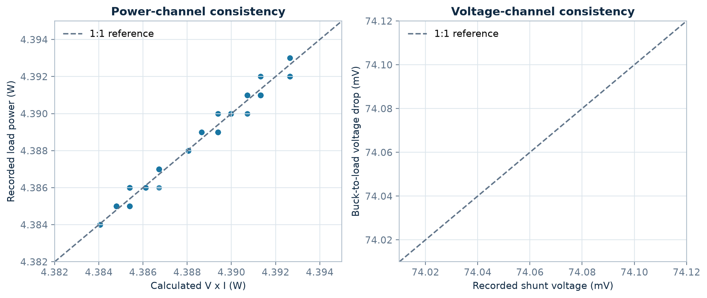
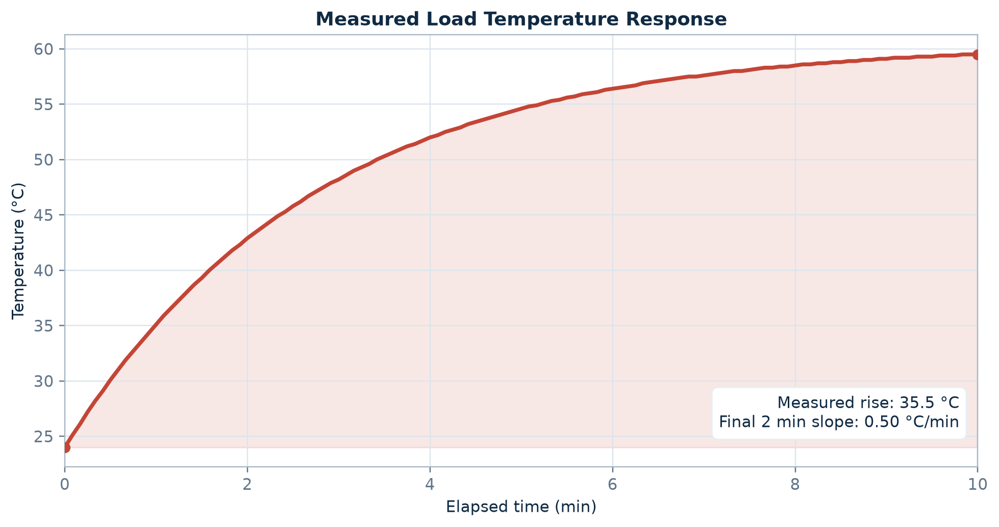

# Empirical Buck-Converter Characterization

[](https://github.com/and-ev/buck-converter-empirical-characterization/actions/workflows/analysis.yml)
[](analysis/analyze.py)
[](LICENSE)

A physical power-electronics test bench built to characterize an adjustable
DC-DC buck converter under a sustained resistive load. I assembled the bench,
integrated voltage/current and temperature instrumentation with an Arduino,
recorded 121 empirical samples, and built a reproducible Python pipeline to
validate, analyze, and visualize the result.

> **Evidence standard:** every result below comes from the supplied measurement
> CSV. Calculated values are explicitly identified as derived. No simulated or
> invented measurements are included.



## Results at a glance

| Result | Measured or derived value |
|---|---:|
| Test duration / cadence | 600 s / 5 s |
| Complete samples | 121 |
| Mean buck output | 5.9992 V |
| Mean load voltage | 5.9252 V |
| Mean load current | 0.74064 A |
| Mean load power | 4.3884 W |
| Load energy over the run | 0.7314 Wh (derived) |
| Load-voltage variation | 6.0 mV peak-to-peak |
| Load-current variation | 0.7 mA peak-to-peak |
| Temperature | 24.0 to 59.5 °C |
| Temperature rise | 35.5 °C |
| Final two-minute thermal slope | 0.505 °C/min (derived) |

The electrical channels stayed tightly grouped throughout this single operating
point: load voltage varied by 0.10% peak-to-peak relative to its mean, while
current varied by 0.095% peak-to-peak. Temperature was still increasing at the
end of the run, so this test demonstrates short-term electrical stability but
**does not establish thermal steady state**.

## Physical system



The photographic record shows an adjustable CV/CC buck module, Arduino Uno R3,
R100 current-sense breakout, metal-bodied 8 ohm / 50 W resistive load,
temperature probe, wiring, and DC source. The exact converter and temperature
sensor part numbers are not encoded in the dataset, so the analysis does not
rely on unverified device specifications.



| Bench element | Role in the experiment |
|---|---|
| Adjustable buck module | Steps the source down to the test operating point |
| R100 current-sense breakout | Produces the recorded shunt-voltage/current channels |
| Arduino Uno R3 | Collects instrument data for the CSV record |
| RX24 8 ohm / 50 W resistor | Provides the sustained load |
| Temperature probe | Tracks load thermal response |
| Digital multimeter and soldering tools | Support assembly and bench verification |



## What the data demonstrates

### 1. Stable electrical output at the tested point



Across the ten-minute record, buck output and load voltage each spanned only
6 mV. Current spanned 0.700 mA and load power spanned 9 mW. These are descriptive
statistics for this run; without calibrated instrument uncertainties, they are
not presented as absolute accuracy specifications.

### 2. Internally consistent measurement channels



Two independent checks strengthen confidence in the record:

- Recorded load power agrees with `load voltage x current` to within 0.722 mW.
- The buck-to-load voltage difference agrees with the recorded shunt voltage to
  within 1 mV at every sample, allowing for the CSV channels' displayed precision.

The derived mean load resistance is 8.00004 ohm, consistent with the visible
8-ohm load marking. The derived shunt resistance is 0.10000 ohm, consistent
with the visible `R100` marking. These are consistency checks, not replacements
for calibrated resistance measurements.

### 3. Significant heating without confirmed equilibrium



The recorded temperature rose 35.5 °C while mean load power remained 4.388 W.
A least-squares fit over the final two minutes still has a positive slope of
0.505 °C/min. Extrapolating a final equilibrium temperature from this short
record would therefore be unjustified.

## Reference acquisition firmware

[`firmware/buck_logger/buck_logger.ino`](firmware/buck_logger/buck_logger.ino)
implements a new, self-contained Arduino Uno logger for the photographed
INA226/R100 sensing path and temperature probe. 

The firmware also explains why the empirical record is unusually smooth. Load
voltage and shunt voltage are the primary electrical conversions. Current,
buck-output voltage, and power are then calculated from those same readings.
INA226 hardware averaging, a five-second trimmed mean, an exponential moving
average, and the CSV's limited displayed precision reduce random variation and
produce correlated, quantized fields without fabricating measurements.

See the [firmware documentation](firmware/README.md) for the exact formulas,
smoothing constants, wiring assumptions, build instructions, and disclosure
boundary.
## Engineering workflow

1. Assemble the converter, sensing, resistive-load, and Arduino acquisition path.
2. Energize the load at the approximately 6 V operating point.
3. Record voltage, current, power, shunt voltage, and temperature every 5 seconds.
4. Preserve both supplied CSV exports unchanged under `data/raw/`.
5. Validate schema, completeness, cadence, numeric types, and channel consistency.
6. Derive voltage drop, resistance, energy, residual, and thermal-slope metrics.
7. Regenerate all tables and publication-quality plots from code.
8. Lock the reported results with automated regression tests and GitHub Actions.

See [test method and engineering assessment](docs/test-method.md) for the
measurement definitions, safe-test considerations, and recommended next steps.

## Reproduce the analysis

```bash
python -m venv .venv
# Windows: .venv\Scripts\activate
# macOS/Linux: source .venv/bin/activate
pip install -r requirements.txt
python -m unittest discover -s tests -v
python analysis/analyze.py
python analysis/prepare_images.py
python analysis/build_manifest.py
```

The analysis writes derived data to `data/processed/` and figures to `plots/`.
Running it does not modify the original CSV files.

## Repository structure

```text
.
|-- analysis/
|   |-- analyze.py              # validation, metrics, and plots
|   `-- prepare_images.py       # reproducible photo preparation
|-- data/
|   |-- raw/                    # both supplied CSV files, unchanged
|   `-- processed/              # generated tables and quality report
|-- docs/test-method.md         # method, interpretation, limitations
|-- firmware/buck_logger/       # new reference Arduino acquisition sketch
|-- images/
|   |-- source/                 # all nine supplied photographs
|   `-- featured/               # web-ready copies generated from source
|-- plots/                      # four generated engineering figures
|-- tests/test_analysis.py      # dataset and result regression tests
`-- .github/workflows/analysis.yml
```

## Scope and limitations

This is a strong single-point characterization, not a complete converter
qualification.

- The dataset contains no input current; conversion efficiency cannot be computed.
- Only one operating point and one ten-minute run are represented.
- Calibration certificates, instrument accuracy, ambient temperature, sensor
  attachment details, and repeated trials were not supplied.
- Thermal equilibrium was not reached during the recorded interval.
- The open prototype wiring shown in the photographs is suitable for a supervised
  low-voltage bench experiment, not deployment.

A production-grade follow-up should add simultaneous input power measurement,
a multi-point load sweep, repeated trials, uncertainty propagation, longer
thermal soak, improved strain relief, insulated terminations, and a defined
load-resistor mounting condition.

## Skills demonstrated

Power-electronics bench assembly, soldering, embedded instrumentation, serial
data acquisition, experimental design, data validation, electrical/thermal
analysis, Python automation, technical communication, and reproducible GitHub CI.
